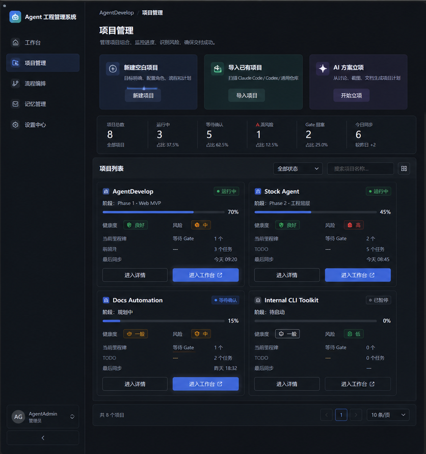
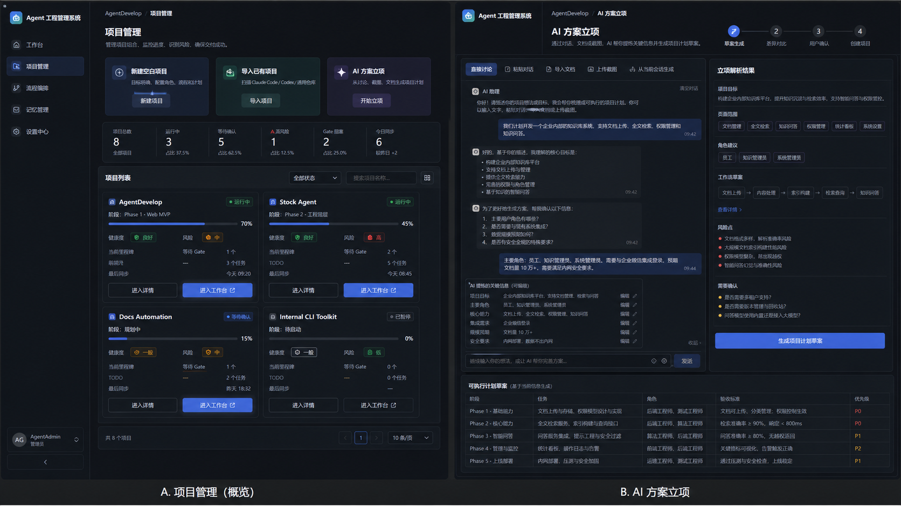
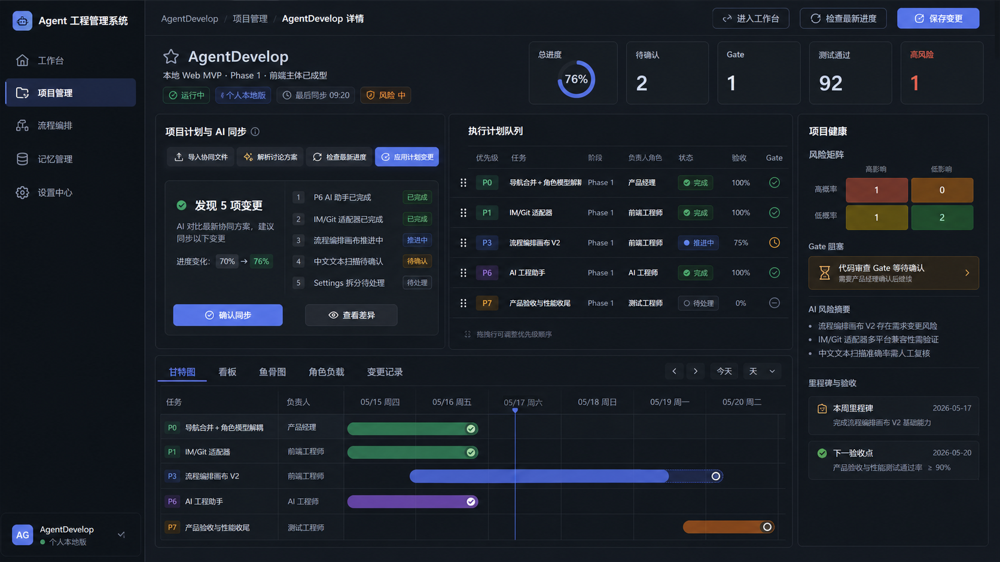
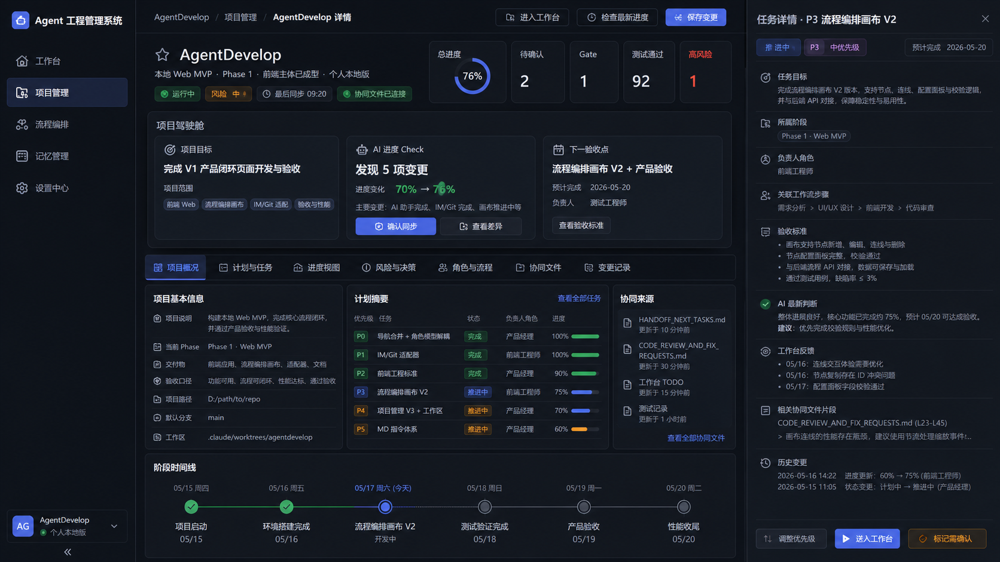
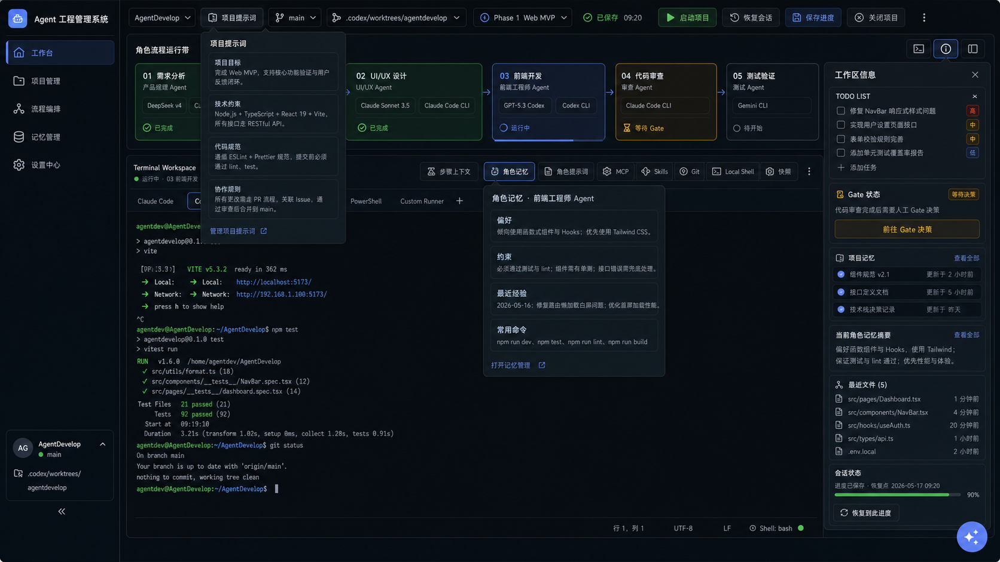
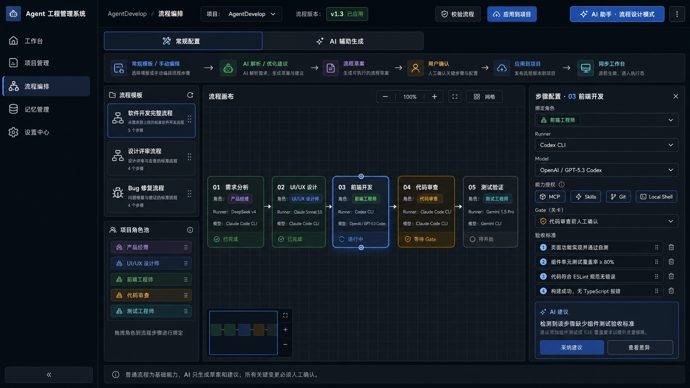
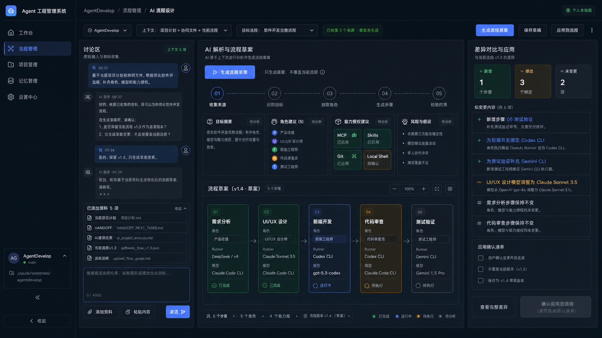
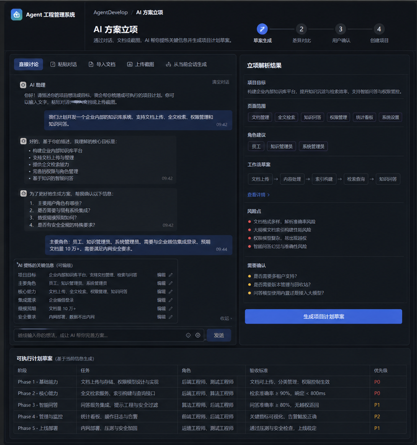
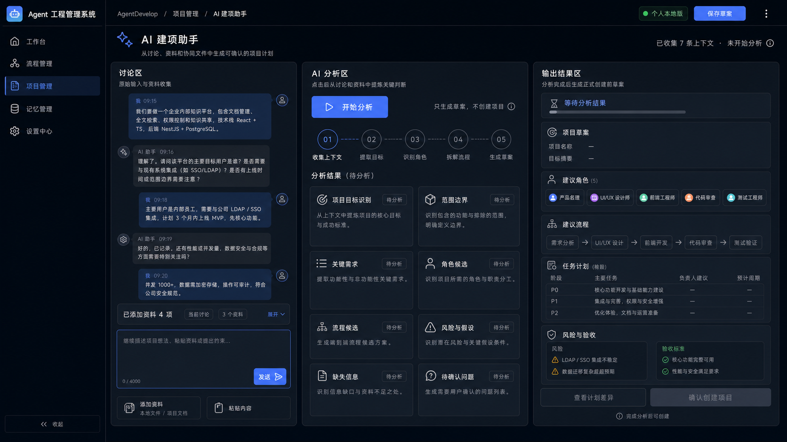
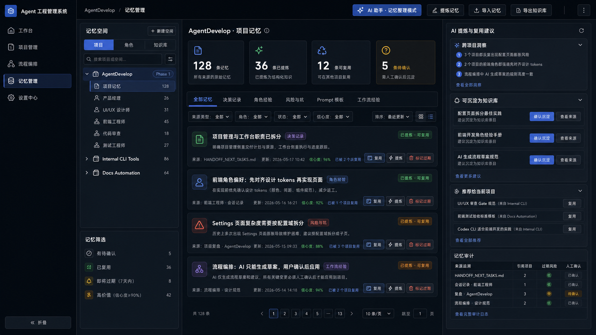

# 当前设计资产索引

这里存放当前仍可作为页面设计参考的图片资产。图片不是最终规格本身，最终页面要求以 [[../../page-spec|页面规格]]、[[../../design-overview|设计总览]] 和 [[../../design-tokens|设计 Token]] 为准。

## 项目管理

### 项目管理总览

关联文档：

- [[../../page-spec|页面规格]]
- [[../../design-overview|设计总览]]

### 项目管理 AI 简报

关联文档：

- [[../../page-spec|页面规格]]

## 项目详情

### 项目详情甘特视图

### 项目详情追踪抽屉

关联文档：

- [[../../page-spec|页面规格]]
- [[../../design-gap-fix-plan|设计差距修复计划]]
- [[../../design-vs-implementation-gap|设计与实现差距]]

## 工作台

### 工作台 V1

关联文档：

- [[../../../generated/superpowers/specs/2026-05-15-agent-workbench-ui-design|Agent 工作台 UI 设计]]
- [[../../page-spec|页面规格]]

## 流程管理与流程设计

### 常规流程设计

### 双模式流程构建

### AI 流程设计

关联文档：

- [[../../../generated/superpowers/specs/2026-05-16-workflow-canvas-design|流程画布设计]]
- [[../../../generated/superpowers/plans/2026-05-16-workflow-canvas-v2|流程画布 V2 计划]]
- [[../../page-spec|页面规格]]

## AI 建项

### 从概览进入 AI 建项

### AI 建项最终稿

关联文档：

- [[../../page-spec|页面规格]]
- [[../../../generated/superpowers/specs/2026-05-16-ai-assistant-design|AI 助手设计]]

## 记忆管理

### 记忆管理知识中心

关联文档：

- [[../../page-spec|页面规格]]
- [[../../../generated/superpowers/specs/2026-05-16-project-md-system-design|项目 Markdown 系统设计]]

## 关联主线

- [[../../../00-导航|文档导航]]
- [[../../README|设计目录说明]]
- [[../../design-overview|设计总览]]
