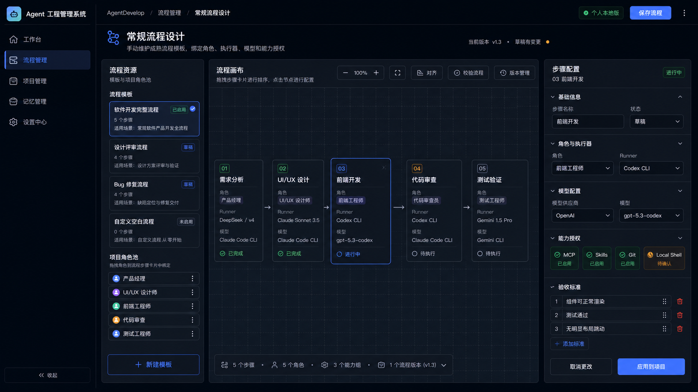

# Agent 工程管理系统 - 设计总览

## 最新冻结补充：流程管理总览 v1

更新时间：2026-05-22  
状态：流程管理总览定稿，作为 `流程管理` 一级入口的当前实现基准。

定稿文件：

- HTML 原型：`docs/design/mockups/flow-management-overview-v1.html`
- Web 预览：`docs/design/mockups/archive/public-mockups/flow-management-overview-v1.html`
- 预览地址：`http://127.0.0.1:5173/mockups/flow-management-overview-v1.html`

产品决策：

- `流程管理` 是流程资产管理首页，不再直接打开流程设计器。
- `常规流程设计`、`AI 流程设计`、`导入流程` 是流程管理总览中的动作入口。
- 先管理流程资产，再进入某个流程的详情或设计器。
- 流程总览按分类组织：`开发类 / 设计类 / 评审类 / 发布类`，并提供分类维护入口。
- 底部解释性的 `流程关系视图` 已移除；关系和配置细节进入流程详情或流程设计器查看。
- 页面不得依赖浏览器 80% 缩放或 CSS `transform: scale(.8)`；100% 缩放下必须完整展示主要内容。

流程管理页面层级：

```text
流程管理总览
├─ 流程 KPI
├─ 分类筛选与分类维护
├─ 流程资产卡片
├─ 流程健康诊断
└─ 操作入口：查看详情 / 进入设计 / AI 生成流程 / 导入流程

流程详情
├─ 流程版本
├─ 应用项目
├─ 步骤与角色绑定
├─ Runner / Model / Capability
└─ 变更记录与风险

流程设计器
├─ 常规流程设计
└─ AI 流程设计
```

## 最新冻结补充：AI 建项与新版工作台导航

### 流程管理 AI 辅助生成与全局 AI 助手

流程管理里的 `AI 辅助生成` 不是独立聊天框，而是全局 AI 助手在流程页的上下文模式。

产品规则：

- 项目计划、协同文件、AI 建项结果、已有流程模板、当前流程版本都是 `可导入/可引用来源`。
- 文件类来源必须有明确的导入动作，Phase 1 先限制 `.md` 文件。
- `已有流程优化` 不是上传文件，而是引用系统中已有流程模板或当前流程版本。
- 大白话描述流程时，不在页面里再做一个孤立聊天系统，而是打开右下角全局 AI 助手，并切换为 `AI 助手 · 流程设计模式`。
- 全局 AI 助手可以接收用户补充说明，并把说明回填到当前 AI 辅助生成任务。

建议 UI：

```text
Workflow AI Assist Panel
├─ 来源导入区
│  ├─ 导入项目计划文件(.md)
│  ├─ 导入协同文件(.md)
│  ├─ 引用当前项目计划
│  ├─ 引用 AI 建项结果
│  └─ 引用已有流程/当前流程版本
├─ 来源解析结果
├─ 流程草案预览
├─ 差异对比
├─ 打开 AI 助手/补充说明
└─ 应用前确认
```

AI 助手与页面关系：

```text
流程页来源导入/引用
       +
全局 AI 助手 · 流程设计模式中的补充说明
       ->
AI 解析 -> 流程草案 -> 差异对比 -> 用户确认 -> 应用到流程版本
```

### AI 方案立项合并为 AI 建项助手

`AI 方案立项` 不再设计成 `直接讨论 / 粘贴对话 / 导入文档 / 当前会话` 四个并列入口。它们本质都是向 AI 提供上下文，因此统一为 `AI 建项助手`：

- 同一个工作区支持聊天、粘贴、上传文档、引用当前会话、读取协同文件。
- AI 把输入内容解析为项目目标、范围、里程碑、角色、任务、风险、验收标准和初始流程建议。
- AI 输出只能是草案和建议，创建项目或写入正式计划前必须人工确认。
- 项目管理总览只保留一个入口：`AI 建项` / `AI 建项助手`。

### 项目详情进入工作台

项目详情页的 `进入工作台` 必须进入新版 `Terminal Workspace` 工作台，而不是旧版工作台或项目管理里的旧执行区。

新版工作台的必备特征：

- 顶部项目、分支、worktree、阶段状态栏。
- 角色流程运行带。
- Terminal Workspace 是最大视觉区域。
- Terminal 工具栏包含 `步骤上下文 / 提示词 / 角色记忆 / MCP / Skills / Git / Local Shell / 快照`。
- 右侧面板只承载 TODO、Gate、项目记忆、最近文件和会话状态。

推荐路由：

```text
/projects/:projectId/workbench
```

过渡期可以使用：

```text
/#workbench?projectId=:projectId
```

但视觉和交互必须是新版工作台。

更新时间：2026-05-17  
状态：工作台、项目管理、流程编排与记忆管理设计冻结，等待实现 Agent 按本文档落地  
范围：Phase 1 Web MVP，前端优先，后端/API 未完成时使用集中 mock data

## 0. 设计图索引

本轮冻结设计图已归档到 `docs/design/assets/`，实现 Agent 应优先对齐这些图，再参考文字规格。

| 页面/场景 | 设计图 |
| --- | --- |
| 工作台冻结版 |  |
| 项目管理总览 + AI 方案立项 |  |
| AI 建项助手 v2 定稿 |  |
| AI 流程设计 v1 定稿 |  |
| 流程管理总览 v1 定稿 | `docs/design/mockups/flow-management-overview-v1.html` |
| 项目详情 - 甘特/项目健康视图 |  |
| 项目详情 - 右侧追溯抽屉 |  |
| 流程编排 - 常规配置 + AI 辅助生成 |  |
| 常规流程设计 v2 定稿 |  |
| 记忆管理 - 项目知识资产中心 |  |

## 1. 产品定位

Agent 工程管理系统用于管理“人与 AI/CLI 工具协作完成软件项目”的全过程。Phase 1 不直接实现真实多 Agent 调度和后端执行，先完成可演示、可验证的 Web MVP。

核心关系：

```text
Project -> Workflow -> Step -> Role -> Agent -> Runner Provider -> Model Provider / Model -> MCP / Skill / Plugin authorization
```

重要产品原则：

- 角色和模型解耦：角色负责职责、提示词、记忆和权限；模型在工作流步骤中选择。
- Runner Provider 独立：Claude Code CLI、Codex CLI、Gemini CLI、Custom Runner 是执行器，不等同于模型。
- 能力中心拆分为 MCP / Skills / Plugins / Agents。
- 工作台负责执行现场，项目管理负责多项目治理、计划、进度、风险和确认。
- AI 可以解析方案、检查进度、提出计划变更，但关键变更需要人工确认。

## 2. 信息架构

一级导航：

- 工作台
- 项目管理
- 流程编排
- 记忆管理
- 设置中心

页面职责：

- 工作台：当前项目的执行驾驶舱，突出 Terminal Workspace、角色流程运行带、TODO、Gate、记忆和会话恢复。
- 项目管理：多项目总览、单项目详情、项目导入、新建空白项目、AI 方案立项、进度 Check、风险和计划管理。
- 流程管理：维护流程资产、流程分类、流程健康、流程详情、常规流程设计和 AI 流程设计，不承担项目执行现场职责。
- 记忆管理：项目记忆、角色记忆、跨项目知识库、AI 提炼中心和记忆审计。
- 设置中心：用户偏好、项目配置、模型配置、Runner Provider、能力中心、IM 适配器、Git 认证。

## 3. 工作台冻结版

工作台是“项目开发现场”，类似 CLI 套壳后的综合控制台。它要符合开发者习惯，把 Terminal Workspace 放在核心区域，而不是让聊天框占据主空间。

### 布局

- 顶部栏：项目选择、分支、worktree、Phase、保存状态、启动项目、恢复会话、保存进度、关闭项目。
- 顶部流程带：展示当前工作流步骤和角色席位。
- 中央主区：Terminal Workspace，占据最大空间。
- 右侧状态面板：TODO LIST、Gate 状态、项目记忆、当前角色记忆摘要、最近文件、会话状态。
- 右侧面板支持固定、浮动、自动隐藏；隐藏后 Terminal Workspace 自动扩展。

### 角色流程运行带

示例步骤：

- 01 需求分析：产品经理 Agent，DeepSeek，Claude Code CLI，已完成
- 02 UI/UX 设计：UI/UX Agent，Claude Sonnet，Claude Code CLI，已完成
- 03 前端开发：前端工程师 Agent，GPT-5.3 Codex，Codex CLI，运行中
- 04 代码审查：审查 Agent，Claude Code CLI，等待 Gate
- 05 测试验证：测试 Agent，Gemini CLI，待开始

交互规则：

- 点击流程卡片后，自动切换到对应 Terminal Tab。
- 流程卡片、Terminal Tab、Terminal 工具栏三方联动。
- 当前步骤授权决定 MCP / Skills / Git / Local Shell 按钮是否可用。

### Terminal Workspace 工具栏

工具栏放在 Terminal Workspace 标题栏右侧，包含：

- 步骤上下文
- 角色记忆
- 角色提示词
- MCP
- Skills
- Git
- Local Shell
- 快照
- 更多

规则：

- MCP / Skills 是当前步骤授权能力快捷入口，不是全局能力中心。
- Git 展示当前仓库状态、分支、diff、最近提交、认证状态。
- Local Shell 打开或切换本地 Shell/PowerShell Terminal Tab。
- 快照用于保存当前开发会话状态。

## 4. 项目管理冻结版

项目管理拆为两个层级：

1. 项目总览：所有项目的简要缩略信息、多项目运行情况、全局风险和待处理事项。
2. 项目详情：单个项目的驾驶舱、计划、进度、风险、角色、协同文件和变更追溯。

项目管理不承担 Terminal 执行功能，执行动作进入工作台完成。

### 项目总览

顶部入口：

- 新建空白项目
- 导入已有项目
- AI 方案立项
- 检查全部项目进度

总览指标：

- 项目总数
- 运行中
- 等待确认
- 高风险
- Gate 阻塞
- 今日同步

项目卡片应展示：

- 项目名称、来源类型、当前 Phase
- 总进度、健康分、风险等级
- 当前里程碑、下一验收点
- 待确认/Gate/TODO 数量
- 最近同步时间、发现变更数量
- 操作：进入详情、进入工作台、Check

### 项目详情

单项目详情采用三层结构：

```text
项目驾驶舱
├─ 管理台账 Tabs
└─ 右侧追溯详情抽屉
```

默认页回答“这个项目现在怎么样”，不一次性铺满所有细节。

顶部状态：

- 项目目标、Phase、运行状态。标题区不堆叠风险、最后同步和协同文件连接状态。
- KPI：总进度、待确认、高风险。Gate 和测试通过不作为顶部 KPI，进入风险与决策、质量/验收或详情面板。
- 操作：返回总览、进入工作台、检查最新进度、保存变更。返回总览为 icon-only。

Tabs：

- 项目概况
- 计划与任务
- 进度视图
- 风险与决策
- 角色与流程
- 协同文件
- 变更记录

右侧抽屉用于展示任务、风险、角色、Gate、协同文件解析详情。

## 5. 项目入口模型

### 新建空白项目

适合目标明确、流程清晰的新项目。

流程：

```text
项目基础信息 -> 角色定义 -> 工作流模板 -> Runner/模型/能力授权 -> 初始项目计划
```

角色可定义：

- 职责
- 角色提示词
- 初始角色记忆
- 默认 Runner / 模型偏好
- MCP / Skill / Plugin 授权
- 参与的工作流步骤

### 导入已有项目

适合已有本地仓库或已有 AI 协作项目。

类型：

- Claude Code 项目：扫描 CLAUDE.md、.claude、agents、skills、worktrees、协同文件。
- Codex 项目：扫描 .codex、threads、plans、handoff、worktrees、任务记录。
- 通用开发项目：扫描 README、package/scripts、docs、tests、git、目录结构。
- 混合项目：同时存在多个 AI 工具或协作结构。

如果是传统项目且缺少协同文件，应要求用户补充：

- 项目目标
- 当前进度
- 当前痛点
- start/test/build 命令
- 模块边界
- 团队角色
- 期望 AI 介入方式
- 是否生成标准协同文件

### AI 方案立项

适合把聊天讨论、粘贴资料、上传文档、截图说明、当前会话和协同文件统一交给 AI 分析，生成新项目计划。

上下文能力：

- 聊天输入
- 粘贴资料
- 上传文档或截图说明
- 引用当前会话
- 读取协同文件

流程：

```text
提出想法 -> AI 追问澄清 -> 沉淀产品方案 -> 生成页面结构/工作流/角色/任务
-> 生成项目计划草案 -> 用户确认 -> 创建正式项目
```

AI 只能生成草案和变更建议，不可直接覆盖正式项目计划。

## 6. 进度 Check

进度 Check 是项目管理核心能力，用于把协同文件、工作台状态和验证结果同步成项目最新进度。

入口：

- 项目总览：检查全部项目进度
- 项目卡片：Check
- 项目详情：检查最新进度

数据来源：

- HANDOFF_NEXT_TASKS.md
- CODE_REVIEW_AND_FIX_REQUESTS.md
- 设计/计划文档
- 工作台 TODO
- 最近 test/build/lint/typecheck 结果
- Gate / 人工确认状态

结果示例：

- P6 AI 助手：已完成
- IM/Git 适配器：已完成
- 流程编排画布：推进中
- 中文文本扫描：待确认
- Settings.tsx 拆分：待处理

输出：

- 进度变化：70% -> 76%
- 风险变化
- 新增阻塞
- 待人工确认
- 建议更新的项目计划

关键规则：检查可以自动完成，应用变更需要用户确认。

## 7. 当前实现约束

- Phase 1 保持前端 Web MVP。
- 不修改后端业务逻辑。
- 真实 CLI、真实 Shell 进程、真实 Git 操作、真实 MCP 调用进入 Phase 2。
- Phase 1 可使用 mock data，但必须集中放置并标注 TODO。
- 不引入不必要的新依赖。
- 优先复用现有 React + TypeScript + CSS token 体系和 lucide-react 图标。

## 8. 流程编排双模式冻结版

流程编排不应只做成 AI 聊天生成器，也不应只保留纯手动画布。最终定位是：

```text
常规流程 = 基础能力
AI 辅助 = 便利能力
用户确认 = 所有关键变更的最终闸门
```

设计图：


### 常规配置模式

常规配置是默认模式，适合成熟流程、标准项目和用户明确知道步骤时使用。

工作方式：

```text
选择流程模板 -> 配置流程步骤 -> 给每个步骤绑定角色
-> 选择 Runner / 模型 / 能力授权 -> 设置 Gate / 验收标准
-> 保存为流程版本 -> 应用到项目 -> 同步到工作台执行
```

页面表现：

- 顶部使用 segmented control：常规配置 / AI 辅助生成。
- 左侧展示流程模板和项目角色池。
- 中间是网格流程画布，可添加、连接、选择、复制、删除步骤。
- 右侧是当前步骤配置面板。
- AI 在该模式下只以“小助手建议”出现，例如校验流程缺口、补验收标准、提示缺少 Gate。

### AI 辅助生成模式

AI 辅助生成适合从项目计划、协同文件、聊天方案或已有流程中快速生成草案。

输入来源：

- 项目详情里的计划与任务。
- 协同文件，例如 HANDOFF_NEXT_TASKS.md、CODE_REVIEW_AND_FIX_REQUESTS.md。
- AI 方案立项结果。
- 已有流程模板或当前流程版本。

工作方式：

```text
导入项目计划 / 协同文件 -> AI 解析角色、任务、Gate 和验收标准
-> 生成流程草案 -> 展示差异 -> 用户确认 -> 应用到项目
```

关键规则：

- AI 只能生成草案、差异和建议，不得直接覆盖正式流程。
- AI 生成的节点必须落到同一套 Step 配置模型中。
- 用户确认后，流程版本状态从“AI 草案”变为“已应用”。

### 两种模式如何配合

两种模式共享同一套流程版本和步骤数据：

```text
常规手动编排
          \
           -> 流程草案 / 流程版本 -> 用户确认 -> 应用到项目 -> 工作台角色流程运行带
          /
AI 辅助生成
```

用户可以先从常规模板开始，再让 AI 检查和优化；也可以先由 AI 生成草案，再进入常规配置模式逐项修改。

### 步骤配置模型

每个 Workflow Step 必须包含：

- 步骤名称
- 绑定角色 roleId
- Runner Provider runnerProviderId
- Model Provider / Model
- MCP / Skill / Plugin 授权
- Gate 类型
- 输入物和输出物
- 验收标准
- 状态：草案、待确认、已应用、执行中、有变更、需重新同步

### 与项目管理和工作台的关系

- 项目详情的“计划与任务”可以触发“生成流程”或“同步到流程编排”。
- 流程编排确认后的版本会进入工作台顶部“角色流程运行带”。
- 工作台执行进度、TODO、Gate 和 Terminal 会话状态再反馈给项目管理。
- 流程变更会在项目详情的“变更记录”中留下 AI 建议、人工确认和应用结果。

## 9. 全局 AI 助手上下文模式

AI 助手不是某一个页面里的聊天框，而是全局入口 + 页面上下文能力。

| 页面 | AI 助手模式 | 主要能力 |
| --- | --- | --- |
| 工作台 | 执行协作助手 | 总结当前步骤、解释 Terminal 输出、生成 TODO、辅助恢复会话、读取项目/角色记忆 |
| 项目管理总览 | 项目治理助手 | 检查全部项目进度、发现风险、汇总阻塞、建议优先级、生成项目周报 |
| 项目详情 | 项目经理助手 | 解析协同文件、同步最新进度、变更计划、拆任务、调整优先级 |
| 流程编排 | 流程设计助手 | 从项目计划生成流程、推荐角色、绑定 Runner/模型/能力、检查流程缺口 |
| 记忆管理 | 记忆整理助手 | 总结项目记忆、角色记忆、清理重复记忆、建议沉淀为规范 |
| 设置中心 | 配置诊断助手 | 检查模型、Runner、MCP、Skills、Git、IM 配置是否完整 |

AI 助手的所有输出都应标记为草案、建议或待确认变更；只有用户确认后才能写入正式项目、流程或任务状态。

## 10. 记忆管理冻结版

记忆管理升级为“项目知识资产中心”。它不是聊天记录列表，而是把项目过程、角色经验、协同文件、AI 对话和执行结果沉淀成可追溯、可复用、可审计的知识资产。

设计图：


### 记忆分层

记忆管理必须分为四层：

```text
项目记忆 -> 角色记忆 -> 可复用知识库 -> 跨项目洞察
```

- 项目记忆：项目目标、边界、阶段、冻结方案、技术决策、风险、进度摘要、协同文件结论。
- 角色记忆：产品、设计、前端、审查、测试等角色的偏好、职责、提示词、经验、常见问题。
- 可复用知识库：经过 AI 提炼和用户确认后的规范、模板、风险清单、Prompt、工作流经验。
- 跨项目洞察：从多个项目中发现反复出现的问题、有效模式、推荐组合和长期经验。

### 页面布局

记忆管理采用三栏布局：

- 左侧：记忆空间，按项目、角色、知识库组织。
- 中间：记忆工作区，展示当前项目或角色的记忆列表、分类、状态和操作。
- 右侧：AI 提炼与复用建议，展示跨项目洞察、可沉淀知识、推荐给当前项目、记忆审计。

### 核心流程

记忆进入知识库必须经过确认：

```text
项目记忆 / 角色记忆 / 协同文件 / 工作台摘要
-> AI 提炼
-> 来源追溯
-> 用户确认
-> 知识库沉淀
-> 新项目 / 新角色 / 新流程复用
```

AI 可以自动发现候选知识，但不能直接写入正式知识库。

### 记忆来源

记忆来源包括：

- HANDOFF_NEXT_TASKS.md
- CODE_REVIEW_AND_FIX_REQUESTS.md
- 设计文档、页面规格、实现计划
- 工作台 TODO、Gate、Terminal 步骤摘要
- 项目详情的计划、风险、决策和变更记录
- 角色提示词和角色执行结果
- AI 方案立项和流程编排草案

### 记忆审计

每条关键记忆必须保留：

- 来源文件或来源页面
- 所属项目
- 所属角色
- 生成方式：人工、AI 提炼、协同文件解析、工作台同步
- 置信度
- 最近更新时间
- 被哪些项目引用
- 是否已确认
- 是否过期或失效

### 复用规则

- 新项目创建时，可从知识库推荐角色提示词、流程模板、验收标准和风险清单。
- 项目详情中，可推荐跨项目经验作为计划调整建议。
- 流程编排中，可推荐常用步骤、Gate 和能力授权。
- 工作台中，可按当前步骤展示项目记忆和角色记忆摘要。
- 所有复用建议都要展示来源和影响范围，用户确认后才能应用。

## 11. 全局 UI Shell 一致性标准

工作台冻结版是当前前端视觉母版。所有一级页面都必须沿用工作台的系统感、密度、颜色、字体、图标和导航结构，不能每个页面各自形成一套标题栏和导航风格。

统一结构：

```text
AppShell
├─ Sidebar
│  ├─ ProductBrand
│  └─ PrimaryNav
└─ MainArea
   ├─ AppTopbar
   │  ├─ Breadcrumb
   │  └─ GlobalStatus / PageActions
   └─ Content
      └─ Page
```

关键规则：

- `工作台 / 流程管理 / 项目管理 / 记忆管理 / 设置中心` 必须共享同一个 `Sidebar + AppTopbar + Content` 框架。
- 侧栏宽度、Logo 位置、导航项高度、图标尺寸、激活态样式不能随页面切换改变。
- 顶部栏高度、面包屑位置、标题字体和右侧操作按钮密度不能随页面切换改变。
- 普通管理页使用统一内容 padding；工作台是唯一允许全屏执行区的例外。
- 页面内部可以有自己的工具栏、画布、抽屉和面板，但不能重新定义一级 Shell。
- 图标统一使用 `lucide-react`，禁止混用 emoji、字母缩写图标和临时符号。

验收标准：

- 从工作台切到流程管理时，用户不应感知到顶部标题、导航栏位置、字体、图标或页面起始高度发生跳动。
- 流程管理可以拥有画布和流程工具，但必须被放在统一 Shell 的内容区内。
- 项目管理、记忆管理、设置中心同样遵循一致的标题行、按钮、卡片、Tabs 和状态样式。

## 12. AI 建项与常规流程设计 v2 定稿

AI 建项 v2 和常规流程设计 v2 已在 2026-05-18 暂时定稿。两张图必须保持同一套视觉系统：统一 Sidebar、AppTopbar、字体、图标、卡片、按钮、圆角、边框和深色工程后台风格。

参考文件：

- `docs/design/assets/ai-project-initiation-v2-final.png`
- `docs/design/assets/workflow-conventional-design-v2-final.png`

AI 建项定稿原则：

- 一个统一 AI 建项工作区，不再拆成 `直接讨论 / 粘贴对话 / 导入文档 / 当前会话` 四个割裂入口。
- 左侧是讨论区，中间是 AI 分析区，右侧是输出结果区。
- 聊天输入框必须有明确 `发送` 按钮。
- 讨论区只保留 `添加资料` 和 `粘贴内容` 两个上下文动作。
- 当前讨论默认进入上下文，不需要独立按钮。
- 已添加资料默认收缩为 `已添加资料 N 项`，点击后展开列表。
- 页面必须能看出“AI 如何把讨论整理成项目”的过程。
- 需要展示项目目标、角色建议、流程建议、任务计划、风险假设、验收标准和创建确认。
- AI 输出只能是草案，用户确认后才创建正式项目。

常规流程设计定稿原则：

- 左侧 `流程资源` 只在上半区显示流程模板，不再在模板旁放 `项目角色` Tab。
- 项目角色统一放在左侧下半区 `项目角色池`。
- 中间画布只展示流程步骤、角色绑定、Runner、模型和能力，不展示 Gate。
- Gate / Manual Gate / 人工决策属于流程应用或执行阶段，不属于常规流程设计画布。
- 右侧步骤配置使用 `验收标准`，不使用 `Gate 与验收`。
## Latest Design Sync - 2026-05-18 - AI 流程设计定稿


AI 流程设计已经从早期的“来源导入面板”调整为“讨论区 + AI 解析 + 差异应用”的三栏设计。

核心定位：

- AI 流程设计用于把用户讨论、项目计划、协同文件、AI 建项结果、当前流程版本统一交给 AI 分析，生成流程草案和差异建议。
- 它不是常规手动流程画布，也不是孤立的全局聊天窗口。
- 左侧讨论区与 AI 建项助手保持一致，承载聊天、资料收集和约束补充。
- 中间负责 AI 解析过程和流程草案画布。
- 右侧负责差异对比、确认清单和应用动作。

Header 定稿：

```text
AgentDevelop / 流程管理 / AI 流程设计

[AgentDevelop] [上下文：项目计划 + 协同文件 + 当前流程] [目标流程：软件开发完整流程] [已收集 5 个来源 · 草案未生成]
                                                     [生成流程草案] [保存草稿] [应用到流程] [...]
```

Header 禁止项：

- 不再放 `导入来源` 按钮。
- 不再放 `打开 AI 助手` 按钮。
- 资料导入和讨论补充都收敛到左侧讨论区。

页面结构：

```text
AIWorkflowDesignPage
├─ WorkflowAiContextHeader
├─ AiWorkflowDiscussionColumn
│  ├─ ChatMessages
│  ├─ AttachedMaterialsStrip
│  └─ DiscussionComposer
├─ AiWorkflowAnalysisDraftColumn
│  ├─ GenerateDraftAction
│  ├─ AnalysisProgress
│  ├─ AnalysisInsightCards
│  └─ WorkflowDraftCanvas
└─ WorkflowDiffApplyColumn
   ├─ DiffSummaryCards
   ├─ ProposedChangeList
   ├─ ApplyChecklist
   └─ ApplyActions
```

关键规则：

- AI 只生成草案和差异，不直接覆盖当前流程。
- 应用前必须经过差异对比和用户确认。
- AI 流程设计画布不出现 Gate、Manual Gate 或人工决策节点。
- 左侧讨论区保留 `添加资料`、`粘贴内容`、`发送`，和 AI 建项助手交互一致。

## 最新冻结补充：AI 流程设计定稿 HTML - 2026-05-19

当前 `流程管理 / AI 流程设计` 的视觉与交互定稿以以下文件为准：

- 设计 HTML：`docs/design/mockups/ai-workflow-design-v1-final.html`
- 运行预览：`docs/design/mockups/archive/public-mockups/ai-workflow-design-v1-final.html`
- 预览地址：`http://127.0.0.1:5173/mockups/ai-workflow-design-v1-final.html`

### 页面定位

AI 流程设计不是普通流程编辑器，也不是独立聊天页。它是一个“从项目计划、协同文件、当前流程和用户补充说明中生成流程草案”的三栏工作区。

三栏职责：

- 左侧讨论区：承载用户和全局 AI 助手的上下文讨论，支持添加资料、粘贴内容、查看已添加资料。
- 中间分析区：承载 AI 分析过程、五步推理状态、目标/角色/能力/风险建议，以及流程草案画布。
- 右侧应用区：承载与当前流程版本的差异、应用确认清单和最终应用动作。

### 最新视觉修正

- 左侧资料列表必须像表格化文件列表一样清晰，不允许文件名、扩展名和图标互相挤压。
- 左侧输入区按钮必须使用图标 + 文案组合，按钮高度、字号、圆角与工作台工具按钮保持一致。
- 中间流程草案是页面主视觉，节点尺寸、画布高度和节点间距要明显强于右侧辅助卡片。
- 中间 AI 分析卡片要紧凑，四个卡片只展示关键结论，不做大段说明。
- 右侧差异面板是辅助面板，字号和卡片高度必须比中间主区域低一档。
- 右侧 `应用确认清单` 和底部操作按钮必须形成一个稳定底部区域，不出现大块空白。

### 行为原则

- 点击 `生成流程草案` 后，只生成草案，不覆盖当前流程。
- 右侧必须先完成确认清单，才能启用 `确认应用到流程`。
- 差异列表要能表达新增、修改、未变更三类结果。
- 正式实现可以先使用 mock data，但数据结构必须能映射到 `Workflow -> Step -> Role -> Runner -> Model -> Capability`。

### 与其他页面关系

- 与 `常规流程设计` 共享同一套全局 Shell、按钮、标签、画布和卡片密度。
- 与 `AI 建项` 共享“左侧讨论 / 中间分析 / 右侧输出或应用”的 AI 工作区理念。
- 与 `工作台` 共享视觉基准：深色工程风格、紧凑密度、lucide 线性图标、稳定 Topbar 和 Sidebar。
## Project Detail Final Baseline - 2026-05-21

项目详情页当前定稿入口：

- `docs/design/mockups/project-detail-trace-drawer-v1.html`
- `docs/design/mockups/archive/public-mockups/project-detail-trace-drawer-v1.html`
- Preview: `http://127.0.0.1:5173/mockups/project-detail-trace-drawer-v1.html`

定稿方向：

- 项目详情页采用“左侧导航 + 中间项目详情 + 右侧常驻详情面板”的三栏结构。
- 左侧导航宽度约 `228px`。
- 中间内容自适应，承载项目标题、KPI 区、项目驾驶舱、分页内容和阶段时间线。
- 右侧详情面板宽度约 `420px`，从全局顶栏下方开始，不进入总导航区域。
- `个人本地版` 放在整个页面最右上角，作为全局状态标签。
- 页面级动作按钮放在项目详情 Hero 区右侧，不放入全局顶栏。

首屏信息结构：

- 项目标题区：项目名、项目阶段说明、运行状态。标题下只保留必要状态，不堆叠同步和协同状态。
- KPI 区：总进度、待确认、高风险。KPI 需要放入独立可见容器 `metric-zone`。`Gate` 和测试通过不进入顶部 KPI 区，保留在风险与决策、质量/验收、协同来源或右侧详情面板中。
- 页面动作区：返回总览、进入工作台、检查最新进度、保存变更。返回总览为 icon-only 按钮；其余动作使用 icon + text 按钮，并放在 KPI 右侧。
- 项目驾驶舱：项目目标、AI 进度 Check、下一验收点。
- 项目详情 Tabs：项目概况、计划与任务、进度视图、风险与决策、角色与流程、协同文件、变更记录。
- 阶段时间线：固定在主内容底部，不能被 Tab 内容撑出页面。

右侧详情面板：

- 常驻显示，不默认关闭。
- 面板标题统一为 `详情面板`，右侧显示当前对象类型，例如 `当前任务`。
- 具体任务名、状态、优先级、预计完成时间放在内容摘要卡里，不放在面板顶栏。
- 当前默认对象为 `任务详情 · P3 流程编排画布 V2`。
- 后续交互应支持随选中对象联动切换：任务、甘特条、风险/Gate、角色、协同文件、变更记录。

角色与流程分页：

- 使用两区布局，不再使用两排横向卡片堆叠。
- 左侧为 `项目角色池`，展示项目角色、职责和默认 Runner/模型标签。
- 右侧为 `流程绑定关系`，展示工作流步骤如何引用左侧角色。
- Tab 内容区必须固定高度并 `overflow: hidden`，避免点击分页后撑高页面、挤压阶段时间线。

协同来源规则：

- `最后同步 09:20` 和 `协同文件已连接` 不放在项目标题下。
- 这些信息进入 `协同来源` 卡片：
  - `HANDOFF_NEXT_TASKS.md` 后显示最后同步时间。
  - 单独显示 `协同连接状态`，说明协同文件已连接和可用来源数量。

布局约束：

- 页面在浏览器 100% 缩放下必须可用，不要求用户手动设置 80% 缩放。
- 不允许使用 `--page-scale: .8`、`transform: scale(.8)` 或浏览器 80% 缩放来模拟目标密度；定稿 HTML 和真实 React 实现都必须转化为紧凑布局 token。
- Tab 内容、右侧详情面板、底部阶段时间线必须在首屏内保持稳定，不允许点击分页后整体页面高度跳动。
